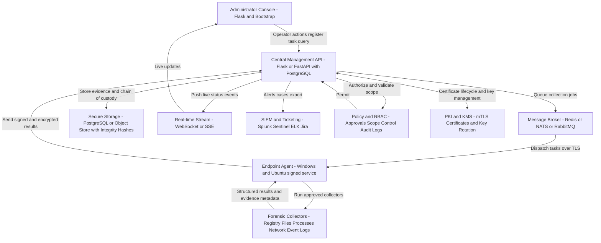

# Proteus
## Cross-Platform Forensic Scripting & Analysis Framework

<p align="center">
  <a href="https://github.com/Jatin-trivedi/Proteus-"></a>
  
  
  
</p>

<p align="center">
  <b>Centralized defensive forensic orchestration with cross-platform endpoint analysis and real-time operational visibility.</b>
</p>

<p align="center">
  🔗 Live Project: <a href="https://proteus-zeta.vercel.app">https://proteus-zeta.vercel.app</a>
</p>

---

## Executive Summary

**Proteus** is a cross-platform forensic scripting and analysis framework designed for **authorized defensive security operations**.  
It enables a central team to orchestrate endpoint forensic tasks, collect structured artifacts, and monitor investigation workflows in near real-time.

### Why this matters
Security teams often struggle with fragmented tools, inconsistent collection procedures, and poor auditability. Proteus addresses this by providing:

- A centralized manager for coordination
- Agent-based endpoint collection
- Structured result handling
- Dashboard visibility for execution and outcomes
- A scalable architecture for multi-endpoint operations

---

## Problem Statement

Modern incident response requires speed, repeatability, and forensic integrity. In many environments:

- Collection workflows are manual and inconsistent
- Endpoint visibility is delayed or incomplete
- Correlating data across hosts is difficult
- Auditable chain-of-custody practices are weak

Proteus provides a unified framework to streamline these workflows while keeping operations defensible, measurable, and extensible.

---

## Solution Overview

Proteus follows a hub-and-spoke model:

1. Analyst/operator creates task from a central interface.
2. Management API validates request scope and policy.
3. Tasks are routed through broker/relay to selected agents.
4. Agents execute approved collectors.
5. Results are returned, persisted, and surfaced in real-time.
6. Outputs can be integrated into SIEM/ticketing systems.

---

## Architecture Flow Diagram



---

## Repository Structure (Current)

```text
Proteus-/
├── .gitignore
├── agent/
├── cloud-relay/
├── compiler/
├── frontend/
├── manager/
├── polymorphic-engine/
├── tests/
├── index.html
├── local_agent.py
├── test_compiler_import.py
├── test_e2e_flow.py
├── test_integration_with_manager.py
└── tree.md
```

### Module Responsibilities

- **manager/**: control plane, task orchestration, ingestion lifecycle
- **agent/**: endpoint runtime, task execution, data return path
- **cloud-relay/**: communication relay/transport support
- **compiler/**: scripting/runtime language subsystem
- **polymorphic-engine/**: transformation experimentation module
- **frontend/** + **index.html**: web dashboard and operator UX
- **tests/** + root test files: integration and end-to-end validation

---

## Technology Profile

Language composition (current snapshot):

- **TypeScript:** 43.7%
- **Python:** 23.0%
- **HTML:** 20.5%
- **CSS:** 4.4%
- **JavaScript:** 3.8%
- **C:** 2.9%
- **Other:** 1.7%

This supports:
- rich typed frontend/dashboard development,
- robust backend orchestration scripting,
- optional low-level/native utility extension.

---

## Core Features

### 1) Centralized Task Orchestration
- Multi-endpoint task assignment
- Configurable collector sets
- Lifecycle status tracking

### 2) Cross-Platform Agent Model
- Windows and Ubuntu target support
- Agent heartbeat and health visibility
- Structured response envelopes

### 3) Forensic Collector Pipeline
- Process, file/log, network, and system-oriented collection paths
- Extensible collector model for future modules

### 4) Real-Time Monitoring
- Task state transitions and progress updates
- Operator-facing live dashboard

### 5) Evidence Integrity-Aware Design
- Result metadata with hash-friendly artifact workflow
- Better traceability from request to stored outputs

### 6) Enterprise Integration Readiness
- SIEM/ticketing export pathways
- Policy/RBAC control points

---

## End-to-End Operational Workflow

1. Operator logs in and creates collection task.
2. Manager validates policy and authorization.
3. Task enters queue and is dispatched.
4. Agents execute requested collectors.
5. Results and metadata return to manager.
6. Evidence is stored for analysis and audit.
7. Dashboard streams live updates to analysts.
8. Outputs can be sent to external SOC systems.

---

## Suggested API Surface (MVP Draft)

### Operator APIs
- `POST /api/v1/tasks` – create task
- `GET /api/v1/tasks/{task_id}` – task status
- `GET /api/v1/tasks/{task_id}/results` – task outputs
- `GET /api/v1/agents` – agent inventory/status

### Agent APIs
- `POST /api/v1/agents/register` – register endpoint
- `POST /api/v1/agents/heartbeat` – liveness/status
- `GET /api/v1/agents/{agent_id}/tasks/poll` – task retrieval
- `POST /api/v1/agents/results` – submit results

---

## Security, Governance & Compliance Posture

- Defensive and authorized usage only
- Role-based access control (RBAC)
- Scope-constrained collection requests
- Encrypted inter-component communication
- Audit trail for action traceability
- Integrity checks for collected artifacts
- Least-privilege execution philosophy

### Recommended hardening checklist
- [ ] Enforce TLS/mTLS end-to-end
- [ ] Secure secret management (KMS/Vault)
- [ ] Disable debug endpoints in production
- [ ] Introduce certificate/key rotation
- [ ] Add immutable audit event pipeline
- [ ] Add data retention and purge policy

---

## Data Model (Recommended Reference)

### `agents`
- id, hostname, os_type, status, last_seen_at, version

### `tasks`
- id, created_by, targets, collectors, status, timestamps

### `task_results`
- id, task_id, agent_id, collector_type, artifact_ref, hash

### `audit_logs`
- actor, action, resource, decision, reason, timestamp

---

## Setup & Local Development

> MVP note: exact startup commands may differ by module maturity.

### Prerequisites
- Python 3.10+
- Node.js 18+
- npm/pnpm
- Git

### Clone
```bash
git clone https://github.com/Jatin-trivedi/Proteus-.git
cd Proteus-
```

### Python environment
```bash
python -m venv .venv
# Windows
.venv\Scripts\activate
# Linux/macOS
source .venv/bin/activate
pip install -r requirements.txt
```

### Frontend setup
```bash
cd frontend
npm install
npm run dev
```

### Run tests
```bash
cd ..
python -m pytest -q
```

---

## Testing Strategy

Current visible tests:
- `test_compiler_import.py`
- `test_e2e_flow.py`
- `test_integration_with_manager.py`
- `tests/` directory

Recommended testing layers:
- unit tests per module
- integration tests across manager/agent/relay
- e2e tests from dashboard request to stored result

---

## Roadmap

- [ ] Stabilize module contracts and interfaces
- [ ] Publish formal API spec (OpenAPI)
- [ ] Add production-grade deployment templates
- [ ] Add CI quality gates (lint/test/security checks)
- [ ] Strengthen observability (metrics/tracing/alerts)
- [ ] Expand documentation and per-module guides

---

## Demo & Screenshots (Add Here)

> Add panel-friendly visuals to improve evaluation clarity.

```text
docs/media/
├── architecture.png
├── dashboard-overview.png
├── task-creation.png
└── live-results.png
```

Example embed:
```markdown
## Dashboard Overview

```

---

## Contribution Guidelines

- Keep changes small and focused.
- Include tests for behavioral changes.
- Document API/contract changes in PR.
- Add risk and rollback notes for non-trivial modifications.

---

## Known MVP Gaps

- Some service contracts are still evolving
- Startup and deployment orchestration can be further unified
- Production security controls need full hardening pass
- Documentation will continue to mature with implementation

---

## Disclaimer

Proteus is intended strictly for **authorized, legal, defensive forensic and incident-response operations**.  
All use must comply with applicable law, organizational policy, and governance standards.

---

## Project Links

- **GitHub Repository:** https://github.com/Jatin-trivedi/Proteus-
- **Live Deployment:** https://proteus-zeta.vercel.app