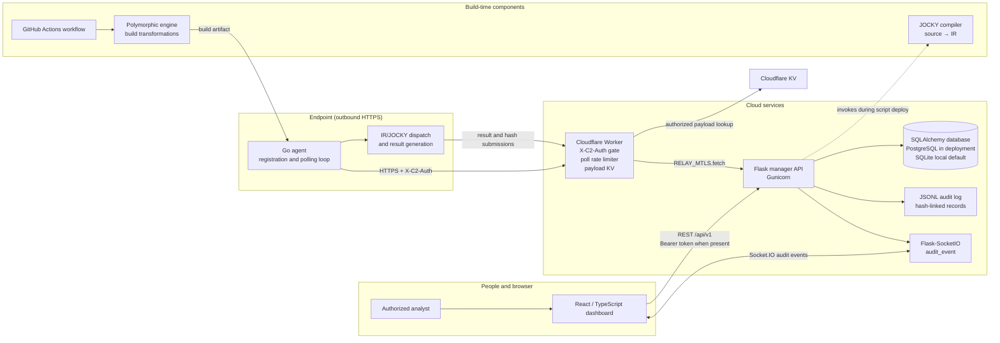
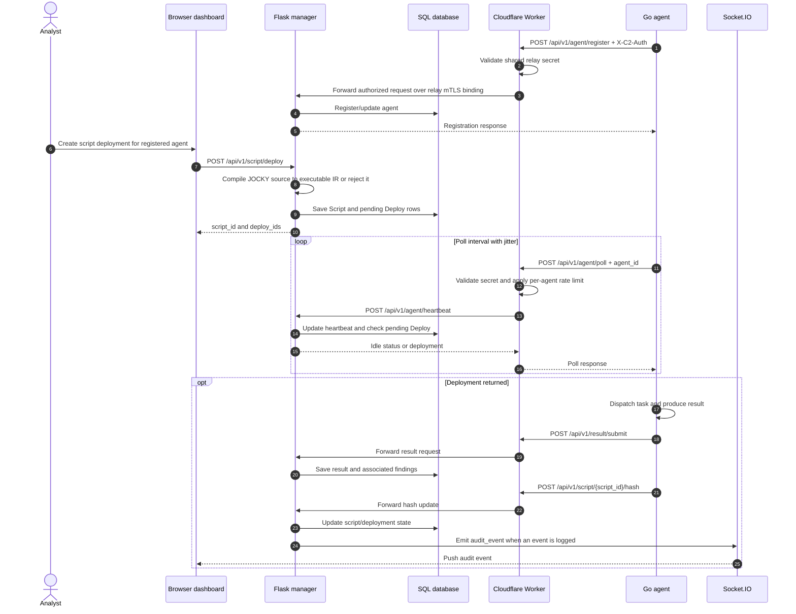

<div align="center">


# Proteus

### Forensic Collection and Analysis Prototype

[](https://github.com/Jatin-trivedi/Proteus-/actions)
[](https://go.dev/)
[](https://python.org/)
[](https://www.typescriptlang.org/)
[](https://workers.cloudflare.com/)
[](https://github.com/Jatin-trivedi/Proteus-)
[](https://sih.gov.in/)

<br/>

**An authorized forensic-collection prototype combining a manager API, a browser
dashboard, a Cloudflare relay, a Go endpoint agent, and the JOCKY scripting
pipeline. This README distinguishes the deployed legacy agent flow from newer
manager APIs that are not yet wired into that agent.**

<br/>

📦 **Repo:** [github.com/Jatin-trivedi/Proteus-](https://github.com/Jatin-trivedi/Proteus-)

</div>

---

## Table of Contents

- [Executive Summary](#-executive-summary)
- [Architecture](#-architecture)
- [Module Overview](#-module-overview)
- [Agent — Go Endpoint Binary](#-agent--go-endpoint-binary)
- [Cloud Relay — Cloudflare Worker](#-cloud-relay--cloudflare-worker)
- [Polymorphic Engine](#-polymorphic-engine)
- [Polymorphic CI/CD Pipeline *(SIH Requirement)*](#-polymorphic-cicd-pipeline-sih-requirement)
- [JOCKY Compiler — Purpose-Built DSL](#-jocky-compiler--purpose-built-dsl)
- [Runtime & Forensic Collectors](#-runtime--forensic-collectors)
- [Frontend Dashboard](#-frontend-dashboard)
- [API Reference](#-api-reference)
- [Setup & Installation](#-setup--installation)
- [Environment Configuration](#-environment-configuration)
- [Security Posture and Limitations](#-security-posture-and-limitations)
- [Technology Stack](#-technology-stack)
- [Project Structure](#-project-structure)
- [Roadmap](#-roadmap)
- [Disclaimer](#-disclaimer)

---

## 🎯 Executive Summary

Proteus is a multi-component project developed for Smart India Hackathon (SIH)
2024. It contains a Flask manager, a React/TypeScript dashboard, a Cloudflare
Worker relay, a Go agent, and Python-based compiler/runtime components.

The codebase currently has **two task interfaces**:

1. The Go agent's active polling loop uses the legacy script/deployment API
   (`/api/v1/agent/poll`, `/api/v1/agent/heartbeat`, and related routes).
2. The manager also exposes a newer job/investigation API under `/api/v1/jobs`
   and `/api/v1/investigations`. Those routes and their token checks exist in the
   manager, but the checked-in Go agent does not currently poll that job API.

Treat security, integrity, and platform statements below as implementation
descriptions—not as a claim of independent security certification or production
readiness. See the [security notes](#-security-posture-and-limitations) before deployment.

---

## 🏛 Architecture

The deployed path is a **browser-to-manager control plane** plus an
**agent-to-relay data path**. The Worker authenticates relay requests, applies a
poll rate limit, and uses its configured mTLS binding for backend requests. It
is not a queue or a database: pending legacy deployments are stored and selected
by the manager.


```mermaid
flowchart LR
    subgraph People["People and browser"]
        Analyst["Authorized analyst"]
        UI["React / TypeScript dashboard"]
        Analyst --> UI
    end

    subgraph Cloud["Cloud services"]
        Worker["Cloudflare Worker<br/>X-C2-Auth gate<br/>poll rate limiter<br/>payload KV"]
        Manager["Flask manager API<br/>Gunicorn"]
        DB[("SQLAlchemy database<br/>PostgreSQL in deployment<br/>SQLite local default")]
        Audit["JSONL audit log<br/>hash-linked records"]
        Socket["Flask-SocketIO<br/>audit_event"]
        UI -->|"REST /api/v1<br/>Bearer token when present"| Manager
        UI <-->|"Socket.IO audit events"| Socket
        Manager --> DB
        Manager --> Audit
        Manager --> Socket
        Worker -->|"RELAY_MTLS.fetch"| Manager
    end

    subgraph Endpoint["Endpoint (outbound HTTPS)"]
        Agent["Go agent<br/>registration and polling loop"]
        Exec["IR/JOCKY dispatch<br/>and result generation"]
        Agent --> Exec
    end

    Agent -->|"HTTPS + X-C2-Auth"| Worker
    Worker -->|"authorized payload lookup"| KV["Cloudflare KV"]
    Exec -->|"result and hash submissions"| Worker

    subgraph Build["Build-time components"]
        Compiler["JOCKY compiler<br/>source → IR"]
        Poly["Polymorphic engine<br/>build transformations"]
        CI["GitHub Actions workflow"]
        Manager -. "invokes during script deploy" .-> Compiler
        CI --> Poly
        Poly -->|"build artifact"| Agent
    end
```

### Deployed legacy agent request sequence

This sequence follows the current Go agent and Worker paths. In particular, the
Worker maps the agent's `/agent/poll` request to the manager's `/agent/heartbeat`
route; result and hash requests are forwarded to their corresponding manager
routes. The diagram does **not** imply the separate `/jobs` API is used by this
agent.


```mermaid
sequenceDiagram
    autonumber
    actor Analyst
    participant UI as Browser dashboard
    participant M as Flask manager
    participant DB as SQL database
    participant W as Cloudflare Worker
    participant A as Go agent
    participant S as Socket.IO

    A->>W: POST /api/v1/agent/register + X-C2-Auth
    W->>W: Validate shared relay secret
    W->>M: Forward authorized request over relay mTLS binding
    M->>DB: Register/update agent
    M-->>A: Registration response

    Analyst->>UI: Create script deployment for registered agent
    UI->>M: POST /api/v1/script/deploy
    M->>M: Compile JOCKY source to executable IR or reject it
    M->>DB: Save Script and pending Deploy rows
    M-->>UI: script_id and deploy_ids

    loop Poll interval with jitter
        A->>W: POST /api/v1/agent/poll + agent_id
        W->>W: Validate secret and apply per-agent rate limit
        W->>M: POST /api/v1/agent/heartbeat
        M->>DB: Update heartbeat and check pending Deploy
        M-->>W: Idle status or deployment
        W-->>A: Poll response
    end

    opt Deployment returned
        A->>A: Dispatch task and produce result
        A->>W: POST /api/v1/result/submit
        W->>M: Forward result request
        M->>DB: Save result and associated findings
        A->>W: POST /api/v1/script/{script_id}/hash
        W->>M: Forward hash update
        M->>DB: Update script/deployment state
        M->>S: Emit audit_event when an event is logged
        S-->>UI: Push audit event
    end
```

### Manager components and maturity

| Component | Responsibility | Current boundary |
|:---|:---|:---|
| Flask API | Auth, agent, script, result, finding, report, investigation, and job routes | Some endpoints use JWT or agent-token decorators; do not assume every route is protected |
| SQLAlchemy models | Users, agents, scripts, deployments, jobs, evidence, and related records | SQLite is the local default; `DATABASE_URL` selects the deployment database |
| Audit logger | Appends structured, hash-linked events and emits selected events over Socket.IO | Local JSONL file; not an external immutable audit service |
| Cloudflare Worker | Checks `X-C2-Auth`, rate-limits polls, serves KV payloads, proxies backend calls | Needs Worker secrets/bindings and backend mTLS configuration |
| Job API | Validates IR and implements job lifecycle routes | Exists separately from the checked-in agent's legacy polling loop |
| CI/build tools | Build and transform agent artifacts | A varying artifact hash alone is not proof of security or semantic equivalence |

---

## 📦 Module Overview

| Module | Language | Role |
|:---|:---:|:---|
| `agent/` | Go | Windows-focused endpoint agent; current polling uses legacy routes |
| `cloud-relay/` | JavaScript (Cloudflare Worker) | Request gate, poll adapter, backend proxy, payload KV |
| `manager/` | Python (Flask) | REST API, SQLAlchemy persistence, Socket.IO audit events |
| `polymorphic-engine/` | Python | Experimental source transformation and build helpers |
| `compiler/` | Python | JOCKY lexer, parser, semantic analysis, IR and code-generation components |
| `runtime/` | Python | Separate typed contracts, IR validation, evidence helpers, and collectors |
| `frontend/` | TypeScript / React | Operator dashboard, real-time results |
| `.github/workflows/` | YAML | Polymorphic CI/CD pipeline |

---

## 🤖 Agent — Go Endpoint Binary

Located in `agent/`. The checked-in agent is Windows-focused; its current
`main.go` imports Windows registry APIs directly, so do not assume it builds
for Linux from the platform-provider files alone.

### Identity and communication

The agent derives an identifier from the host and account values available at
runtime. This is a correlation identifier, not an authentication credential.

The current agent flow:

- Registers with `POST /api/v1/agent/register` through the Worker.
- Polls `POST /api/v1/agent/poll`; the Worker adapts this to the manager's
  heartbeat endpoint and returns an available legacy deployment, if any.
- Submits results to `POST /api/v1/result/submit` and a result hash to
  `POST /api/v1/script/{script_id}/hash`.
- Sends `X-C2-Auth` to the Worker. The agent identifier itself is not a secret.

### Execution and operational caution

The agent contains a legacy task dispatcher and Windows-specific capabilities
that go beyond read-only collection, including command execution and process,
privilege, and persistence-related code paths. The JOCKY compiler's allowlist
does not sandbox every path through that dispatcher. Review the code and run
only in an isolated environment with explicit authorization; do not deploy this
agent to production endpoints as-is.

---

## ☁️ Cloud Relay — Cloudflare Worker

Located in `cloud-relay/`. Deployed as a **Cloudflare Worker** using `wrangler`.

### Features

| Feature | Detail |
|:---|:---|
| **Request gate** | Requires `X-C2-Auth`; requests with a missing or invalid value receive a redirect response |
| **Payload lookup** | Reads `/payloads/<name>` from the configured KV namespace |
| **Agent poll adapter** | Maps `POST /api/v1/agent/poll` to the manager's `/api/v1/agent/heartbeat` route and applies a per-agent rate limit |
| **Backend proxy** | Forwards other authorized paths to `BACKEND_URL` after removing `X-C2-Auth` |
| **Backend transport** | Uses the `RELAY_MTLS` binding; requests fail when the binding is absent |

### Configuration (`wrangler.toml`)

```toml
[vars]
BACKEND_URL = "https://jockey-framework.onrender.com"

[[mtls_certificates]]
binding = "RELAY_MTLS"
certificate_id = "<certificate-id-from-your-Cloudflare-account>"

[[kv_namespaces]]
binding = "PAYLOAD_KV"
id = "<your-kv-id>"

[[ratelimits]]
name = "AGENT_POLL_RATE_LIMITER"
namespace_id = "<unique-positive-integer>"

  [ratelimits.simple]
  limit = 60
  period = 60
```

Set the secret with `npx wrangler secret put C2_AUTH`. Configure the manager's
`MTLS_REQUIRED`, `MTLS_SERVER_CERT`, `MTLS_SERVER_KEY`, and `MTLS_CLIENT_CA`
settings to match the relay certificate. The Worker checks the shared secret
and does not forward it to the manager. That shared secret is a relay gate, not
a substitute for manager user or agent authentication.

---

## 🔄 Polymorphic Engine

Located in `polymorphic-engine/src/`. This package contains experimental
source-transformation helpers and a standalone build orchestrator. It is
separate from the GitHub Actions build path, which currently builds the Go
agent with `garble`; neither approach guarantees security or equivalent
behavior.

### Transformation helpers

| Module | Scope |
|:---|:---|
| `control_flow_flattener.py` | Attempts to rewrite supported control-flow constructs |
| `import_table_obfuscator.py` | Provides import and binary transformation helpers |
| `junk_code_injector.py` | Adds generated statements for supported Python inputs |
| `variable_encryption.py` | Transforms supported string literals |
| `hash_generator.py` | Generates hashes and per-run seed material |

These names describe transformation intent, not a guarantee that every
transformation applies to every input or that resulting artifacts are secure,
undetectable, or behaviorally equivalent. Verify the generated artifacts and
tests for the specific target before relying on them. The separate
`polymorphic-engine/src/orchestrator.py` can invoke selected helpers; it is not
the workflow used by `.github/workflows/build.yml`.

---

## 🚀 Polymorphic CI/CD Pipeline *(SIH Requirement)*

Implemented in `.github/workflows/build.yml`. `ci_build.py` is a separate build
helper and is not called by this workflow.

The workflow runs on pushes to `main` and can also be started manually:

```
git push → GitHub Actions (ubuntu-latest)
              │
              ├─ 1. Checkout repo
              ├─ 2. Set up Go 1.27 and Python 3.11
              ├─ 3. Install toolchains and project dependencies
              ├─ 4. Build the Windows C engine and Go agent
              ├─ 5. Attempt Python and C test suites (non-blocking in this workflow)
              ├─ 6. Calculate and report the artifact SHA-256
              └─ 7. Upload the generated artifact
```

The workflow records an artifact hash and uploads the build output. Its Python
and C test steps are configured as non-blocking, so a green workflow does not
necessarily mean every test passed. A changing hash demonstrates byte-level
variation, not that behavior is unchanged or that the artifact is safe. Review
the [workflow definition](.github/workflows/build.yml) and generated artifact
for each build. Branch protection requirements depend on repository settings
and are not defined by the workflow file.

---

## ⚙️ JOCKY Compiler — Purpose-Built DSL

Located in `compiler/`. The JOCKY compiler converts supported source programs
into an intermediate representation (IR). The manager's script deployment
route requires successful compilation and queues only the resulting IR. Scripts
that do not compile are rejected before a deployment is created; raw JOCKY
source is never passed through as a shell command.

### Compiler Pipeline

```
Source (.jocky)
    │
    ▼
Lexer (tokenizer.py)
    │  Token stream
    ▼
Parser (parser.py)
    │  AST (Abstract Syntax Tree)
    ▼
Semantic Analyzer (analyzer.py)
    │  Type checking · Scope resolution · Builtin validation
    ▼
IR Generator (generator.py)
    │  ForensicIRDocument (intermediate representation)
    ▼
IR Validator (validator.py)
    │  Allowlist enforcement · Schema validation
    ├── Manager script deployment: serialize validated IR and queue a Deploy
    └── Separate code-generation modules: LLVM-related output where supported
```

### Forensic Function Registry

The semantic analyzer enforces that only **registry-approved functions** can appear in a JOCKY script:

| Namespace | Functions |
|:---|:---|
| `system` | `system.info`, `system.users` |
| `processes` | `processes.list`, `processes.details` |
| `network` | `network.interfaces`, `network.connections`, `network.routes`, `network.dns` |
| `filesystem` | `filesystem.metadata`, `filesystem.hash` |

Unknown calls are rejected by the compiler's semantic checks. The manager
compiles scripts before dispatch; it also compiles raw JOCKY source in older
pending deployments before agent delivery. Scripts that fail compilation are
marked failed instead of being passed to the endpoint shell. The manager's
Vercel project is rooted at `manager/`, so its bundled compiler core is kept in
`manager/compiler/`; a deployment test verifies it compiles with that root alone.

### Example JOCKY Script

```jocky
analysis "Forensic Baseline" {
    processes.list();
    filesystem.hash("./evidence");
    network.connections();
}
```

---

## 🔍 Runtime & Forensic Collectors

Located in `runtime/`. This Python runtime provides contracts, IR validation,
evidence helpers, and forensic collectors. It is a separate component: the
checked-in Go agent implements its own polling and execution path and does not
use the Python heartbeat client.

### Agent Communication Contracts

All manager ↔ agent messages are strongly typed (`contracts.py`):

| Contract | Purpose |
|:---|:---|
| `AgentRegistrationRequest/Response` | First contact, receives `agent_id` |
| `AgentHeartbeatRequest/Response` | Liveness + task poll, status transitions |
| `AgentTask` | Dispatched JOCKY IR job |
| `AgentTaskPollResponse` | Wraps pending task queue |
| `AgentResultEnvelope` | Structured result payload with optional integrity data |
| `IntegrityEnvelope` | SHA-256 digest over canonicalized results |

The digest supports integrity comparison; it is not a digital signature or
proof of who produced the results. The strict IR validation in these Python
contracts does not automatically cover the separate legacy Go dispatcher.

### Heartbeat Lifecycle

```
UNREGISTERED → [register()] → ONLINE
    │
    ├── poll() returns task → BUSY → execute → ONLINE
    ├── network error      → exponential backoff (1s → 2s → 4s → 8s … 60s max)
    └── no heartbeat > 90s → OFFLINE (manager marks agent lost)
```

### 10 Approved Forensic Operations

| Operation | Windows | Linux | Description |
|:---|:---:|:---:|:---|
| `system.info` | ✅ | ✅ | OS, hostname, uptime, architecture |
| `system.users` | ✅ | ✅ | Local user accounts and groups |
| `processes.list` | ✅ | ✅ | Running process inventory (PID, name, user) |
| `processes.details` | ✅ | ✅ | Full process metadata including parent, path |
| `network.interfaces` | ✅ | ✅ | NIC inventory, IP/MAC addresses |
| `network.connections` | ✅ | ✅ | Active TCP/UDP connections with PIDs |
| `network.routes` | ✅ | ✅ | Routing table dump |
| `network.dns` | ✅ | ✅ | DNS cache and resolver config |
| `filesystem.metadata` | ✅ | ✅ | File stat, timestamps, permissions |
| `filesystem.hash` | ✅ | ✅ | SHA-256 of file content |

### Evidence Integrity

Every collected artifact is wrapped in an `EvidenceItem`:

```python
EvidenceItem(
    evidence_id   = uuid4(),
    operation     = "processes.list",
    collected_at  = datetime.now(UTC),
    schema_version= "1.0",
    data          = { ... },
    data_hash     = sha256(canonical_json(data)),  # deterministic
    collector_version = "1.0.0",
)
```

The `data_hash` is computed over **canonical JSON** (sorted keys, no whitespace)
so identical data produces the same digest. A digest alone does not establish
authenticity or prevent an actor with write access from replacing both data
and digest.

### Platform Providers

| Provider | Implementation |
|:---|:---|
| Windows | `tasklist` CLI parsing, `ipconfig /all`, `netstat -ano`, `route print`, Win32 `GetTickCount64`, `APPDATA`/`C:\Users` enumeration |
| Linux | `/proc/` filesystem, `ss`, `ip route`, `/etc/resolv.conf`, `getent`, `psutil` |
| psutil fallback | Cross-platform fallback for any OS where native providers are unavailable |

---

## 🖥 Frontend Dashboard

Located in `frontend/`. The browser client uses `VITE_API_BASE_URL` when set;
otherwise it requests `/api/v1` from the same origin. Configure the frontend
deployment's API base URL to point at the intended manager deployment.

- **TypeScript + React**
- Real-time audit events via Socket.IO
- Operator task creation form
- Agent inventory table (status, OS, last seen)
- Live result viewer
- Evidence browser with hash verification display

---

## 📡 API Reference

The manager registers these routes in Flask. The dashboard currently uses the
script/deployment-oriented endpoints; route availability does not imply that
every endpoint has the same authentication policy.

| Method | Endpoint | Description |
|:---|:---|:---|
| `POST` | `/api/v1/auth/register` | Register a user and return an access token |
| `POST` | `/api/v1/auth/login` | Authenticate a user and return an access token |
| `GET` | `/api/v1/agent/` | List agents |
| `POST` | `/api/v1/script/deploy` | Compile/deploy a script through the legacy deployment model |
| `GET` | `/api/v1/script/deployments` | List deployments |
| `GET` | `/api/v1/result/list` | List results |
| `GET` | `/health` | API and database health check |

### Legacy agent → manager APIs (through Worker)

| Method | Endpoint | Description |
|:---|:---|:---|
| `POST` | `/api/v1/agent/register` | Register/update an agent |
| `POST` | `/api/v1/agent/poll` | Worker adapter; translated to manager `/api/v1/agent/heartbeat` |
| `POST` | `/api/v1/result/submit` | Submit a result |
| `POST` | `/api/v1/script/{script_id}/hash` | Submit the result hash |

### Separate manager job API

| Method | Endpoint | Description |
|:---|:---|:---|
| `POST` | `/api/v1/jobs` | Create a job after server-side IR validation |
| `GET` | `/api/v1/jobs` | List jobs |
| `GET` | `/api/v1/agents/{agent_id}/jobs/next` | Agent-token-protected job claim |
| `POST` | `/api/v1/jobs/{job_id}/ack` | Agent-token-protected acknowledgement |
| `POST` | `/api/v1/jobs/{job_id}/results` | Agent-token-protected result submission |

The job API has additional get, cancel, and investigation routes. It is a
distinct implementation path: the checked-in Go agent currently uses the
legacy poll/deployment routes above.

### Relay payload API

| Method | Endpoint | Description |
|:---|:---|:---|
| `GET` | `/payloads/<name>` | Read a payload from the configured Worker KV namespace |

---

## 🛠 Setup & Installation

Commands below are run from the repository root unless a step changes
directories.

### Prerequisites

| Tool | Version | Purpose |
|:---|:---:|:---|
| Go | ≥ 1.25 | Agent compilation |
| Python | ≥ 3.11 | Manager, engine, compiler, runtime |
| Node.js | 20.19+ or 22.12+ | Frontend dev server (Vite 8) |
| Wrangler | ≥ 3 | Cloudflare Worker deploy |
| Git | any | Source control |

### 1. Clone the repository

```bash
git clone https://github.com/Jatin-trivedi/Proteus-.git
cd Proteus-
```

### 2. Create and activate a Python environment

```bash
python -m venv .venv

# Windows PowerShell
.venv\Scripts\activate

# Linux / macOS
source .venv/bin/activate
```

### 3. Install and run the manager API

The manager's audit logger uses the POSIX `fcntl` module for file locking.
Run the manager and its tests on Linux, macOS, or WSL; native Windows Python
cannot import that module.

The manager uses SQLite by default for local development. To use PostgreSQL,
set `DATABASE_URL` to a PostgreSQL connection string; the manager requirements
include both Psycopg 3 and the legacy Psycopg 2 driver.

```bash
python -m pip install -r manager/requirements.txt -r compiler/requirements.txt
cd manager
python -m flask --app app run --host 127.0.0.1 --port 5000
```

Keep this terminal running. Use a second terminal, with the virtual environment
activated and the current directory set to the repository root, for the
remaining setup and test commands.

For a deployment, set a strong `JWT_SECRET`, configure `DATABASE_URL`, and
configure mTLS on both the Worker and manager if using the checked-in relay
configuration. `manager/.env.example` documents manager-side mTLS settings.
For Render, use `manager/` as the service root so its Dockerfile and
requirements file are used.

### 4. Install additional engine and test dependencies

From the second terminal at the repository root:

```bash
python -m pip install -r polymorphic-engine/requirements.txt
```

### 5. Agent build

The agent build is **not a portable one-command setup**. The checked-in
PowerShell helper expects a prebuilt execution-engine DLL and contains a
machine-specific Go SDK path. The GitHub Actions workflow is a separate
Linux-hosted Windows build and requires repository secrets. Review the build
scripts and workflow in an isolated, authorized environment before attempting
to produce an agent artifact; do not put credentials or secret values in this
README or source control.

### 6. Deploy the Cloud Relay

```bash
cd cloud-relay
npm install -g wrangler
wrangler login
wrangler secret put C2_AUTH          # set your auth token
wrangler kv:namespace create PAYLOADS
# Update wrangler.toml with your KV namespace ID
wrangler deploy
```

### 7. Frontend development server

```bash
cd frontend
npm ci
npm run dev
# → http://localhost:3000
```

### 8. Run tests

Run these from the repository root with the relevant dependencies installed.

```bash
# Full Python test suite
python -m pytest -q

# Manager tests
python -m pytest manager/tests/ -q

# Runtime-specific tests (when present)
python -m pytest runtime/tests/ -v

# End-to-end flow
python -m pytest -q test_e2e_flow.py
```

---

## ⚙️ Environment Configuration

Copy `.env.example` to `.env` and fill in your values:

```bash
cp .env.example .env
```

| Variable | Default | Description |
|:---|:---:|:---|
| `DATABASE_URL` | Manager-local SQLite file | SQLAlchemy database URL; use PostgreSQL for a hosted manager |
| `JWT_SECRET` | Development fallback in code | Secret used to sign manager user tokens; set a strong value in every deployment |
| `SECRET_KEY` | — | Backwards-compatible JWT secret fallback |
| `CORS_ALLOWED_ORIGINS` | Local and configured frontend origins | Comma-separated manager CORS allowlist |
| `MTLS_REQUIRED` | `false` | Require a client certificate at the manager TLS endpoint |
| `MTLS_SERVER_CERT` | — | Manager TLS certificate path |
| `MTLS_SERVER_KEY` | — | Manager TLS private-key path |
| `MTLS_CLIENT_CA` | — | CA certificate used to verify relay client certificates |
| `AUDIT_LOG_PATH` | `manager/audit.log` | Path for the manager's JSONL audit log |
| `VITE_API_BASE_URL` | `/api/v1` | Frontend manager API base URL |
| `C2_AUTH` | Set as a Worker secret and CI secret | Shared relay secret; do not commit it |
| `C2_AUTH_XOR` | Set as a CI secret | Build-time value used by the workflow; do not commit it |
| `BACKEND_URL` | Configured in `wrangler.toml` | Manager origin used by the Worker |

> **Never commit `.env` or secrets.** The `.gitignore` excludes `.env` and all `.env.*` variants except `.env.example`.

The manager accepts `SECRET_KEY` as a backwards-compatible fallback, but
deployments should set `JWT_SECRET`. The frontend listens for `audit_event`
Socket.IO messages emitted by the manager's audit logger.

---

## 🔐 Security Posture and Limitations

Proteus is a prototype, not a hardened or independently audited product. Use
it only with explicit authorization and in a controlled test environment.
Important implementation boundaries:

- The Worker checks `X-C2-Auth`, removes it before proxying, rate-limits the
  poll adapter, and requires the `RELAY_MTLS` binding for backend fetches.
  The manager only requires client certificates when `MTLS_REQUIRED` and its
  certificate settings are configured correctly.
- The shared relay secret does **not** authenticate a user to the manager.
  User JWTs and agent tokens are used by selected API routes; several legacy
  agent and script routes do not apply those decorators. Review route-level
  authorization before exposing the manager to an untrusted network.
- The legacy Go agent has command-execution and other Windows-specific
  capabilities. The compiler allowlist and Python runtime validation do not
  constrain every path through the legacy agent dispatcher.
- The runtime computes SHA-256 digests for integrity comparison. Digests are
  not signatures and do not prove who created a result.
- Audit events are stored in a local JSONL file with hash links and emitted
  over Socket.IO. This is not an external, immutable, access-controlled audit
  service; protect and back up the file appropriately.
- TLS, database availability, secret management, access controls, and retention
  depend on deployment configuration. Do not treat the demo defaults as safe
  production settings.

Before any deployment, review the manager routes and agent code, replace all
development secrets, restrict network access, configure TLS/mTLS deliberately,
and test the complete path using non-sensitive data.

---

## 🧰 Technology Stack

| Layer | Technology | Version |
|:---|:---|:---:|
| Endpoint Agent | Go | See `agent/go.mod` and CI workflow |
| Agent OS binding | `golang.org/x/sys` | 0.47.0 |
| C2 Relay | Cloudflare Workers | — |
| Relay storage | Cloudflare KV | — |
| Polymorphic Engine | Python | 3.11 |
| Binary analysis | `pefile`, `lief`, `capstone`, `pyelftools` | various |
| Crypto | `pycryptodome`, `cryptography` | — |
| DSL Compiler | Python + `llvmlite` | — |
| Agent runtime | Python | 3.11 |
| Cross-platform info | `psutil` | — |
| Frontend | TypeScript / React | — |
| Frontend deploy | Vercel | — |
| CI/CD | GitHub Actions | — |
| Backend container | Docker / Gunicorn | See `manager/Dockerfile` |

---

## 📁 Project Structure

```
Proteus-/
├── .github/
│   └── workflows/
│       └── build.yml           # Polymorphic CI/CD pipeline (SIH requirement)
│
├── agent/                      # Windows-focused Go endpoint agent
│   ├── main.go                 # Registration, polling, dispatch, result submission
│   ├── ir_executor.go          # IR operation dispatch
│   ├── bridge.go               # Windows execution-engine bridge
│   ├── build.ps1               # Local Windows build + garble script
│   ├── go.mod
│   └── go.sum
│
├── cloud-relay/                # Cloudflare Worker C2 relay
│   ├── worker.js               # Edge relay with auth gate + KV payload store
│   └── wrangler.toml
│
├── polymorphic-engine/         # Binary transformation subsystem
│   └── src/
│       ├── orchestrator.py     # Build pipeline coordinator
│       ├── control_flow_flattener.py
│       ├── import_table_obfuscator.py
│       ├── junk_code_injector.py
│       ├── variable_encryption.py
│       ├── hash_generator.py
│       └── obfuscator.py       # Master PolymorphicObfuscator class
│
├── compiler/                   # JOCKY DSL compiler
│   ├── lexer/                  # Tokenizer
│   ├── parser/                 # AST + grammar
│   ├── semantic/               # Type checker + function registry
│   ├── ir/                     # Intermediate representation
│   ├── codegen/                # LLVM code generation
│   └── diagnostics/            # Error reporting
│
├── runtime/                    # Separate Python runtime and contracts
│   ├── agent/
│   │   ├── contracts.py        # Typed API models (register/heartbeat/result)
│   │   ├── heartbeat_client.py # Heartbeat loop + exponential backoff
│   │   ├── evidence.py         # SHA-256 evidence integrity
│   │   ├── job_executor.py     # Approved job execution
│   │   └── ir_validator.py     # IR allowlist enforcement
│   ├── collectors/             # 10 forensic collectors
│   ├── providers/              # Windows + Linux + psutil platform providers
│   └── registry.py             # OperationRegistry (10 approved ops)
│
├── frontend/                   # TypeScript / React dashboard
├── ci_build.py                 # Separate build helper (repo root)
├── .env.example                # Repository-level environment template
└── README.md
```

---

## 🗺 Roadmap

### In Progress
- [ ] Stabilize manager API contracts and publish OpenAPI spec
- [ ] Full end-to-end integration test (dashboard → agent → evidence)
- [ ] Linux agent (`GOOS=linux`) CI target alongside Windows

### Planned
- [ ] Verify and document end-to-end mTLS configuration for deployed environments
- [ ] KMS / HashiCorp Vault for secret management
- [ ] Production deployment templates (Docker Compose / Kubernetes)
- [ ] SIEM export (Splunk, Sentinel, ELK) via structured event pipeline
- [ ] Rate limiting and DDoS protection on relay endpoints
- [ ] Immutable audit event log (append-only, signed)
- [ ] Data retention and purge policy enforcement
- [ ] Per-module documentation and developer guides

### CI/CD Enhancements
- [ ] Add `garble` step to workflow (randomize symbol names at Go compiler level)
- [ ] Matrix build: `windows/amd64`, `linux/amd64`, `linux/arm64`
- [ ] Hash-diff check: CI fails if two consecutive binaries are identical (regression guard)
- [ ] Automatic version tagging (`v1.0.<run_number>`)

---

## ⚠️ Disclaimer

**Proteus is designed exclusively for authorized, legal, defensive forensic and incident-response operations.**

All deployment and use of this framework must:
- Have explicit written authorization from the owner of target systems
- Comply with all applicable local, national, and international laws
- Adhere to the organization's internal security and governance policies
- Be conducted only by qualified security professionals with appropriate oversight

The authors and contributors of Proteus accept no liability for unauthorized, illegal, or unethical use of this software.

---

<div align="center">

**Built for Smart India Hackathon (SIH) 2024**

[GitHub](https://github.com/Jatin-trivedi/Proteus-)

</div>
