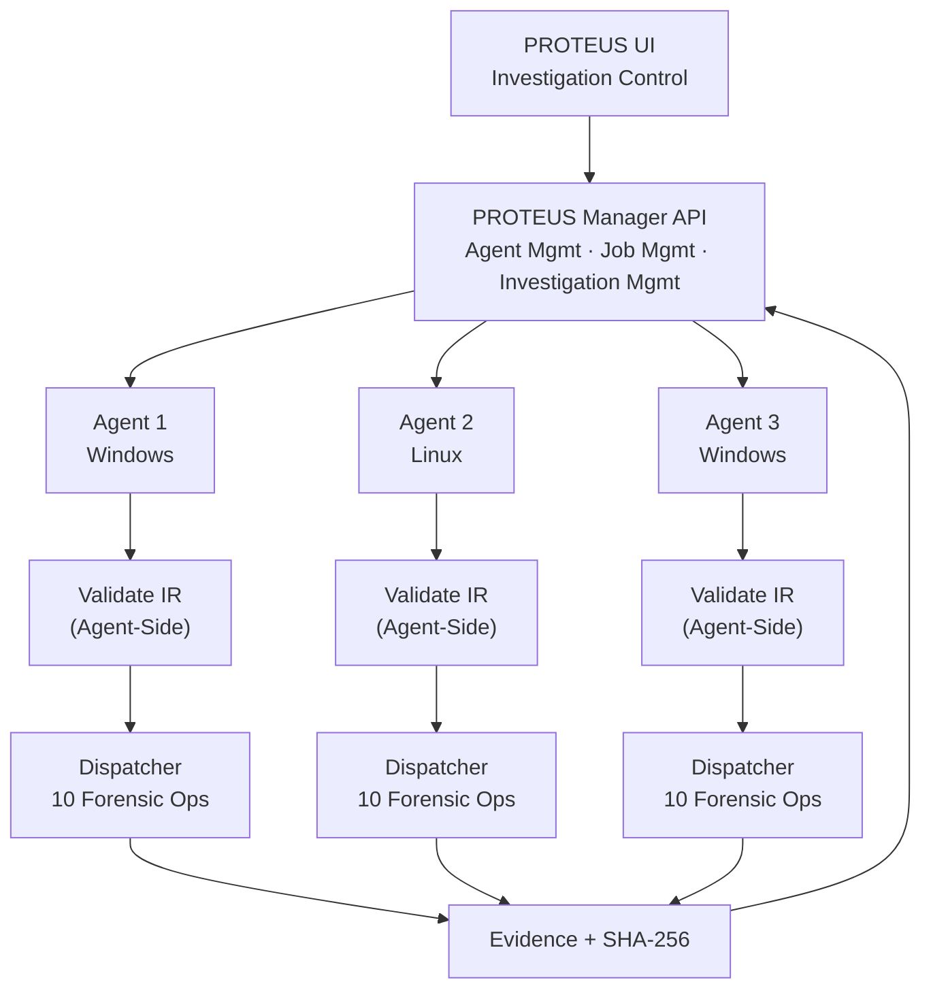
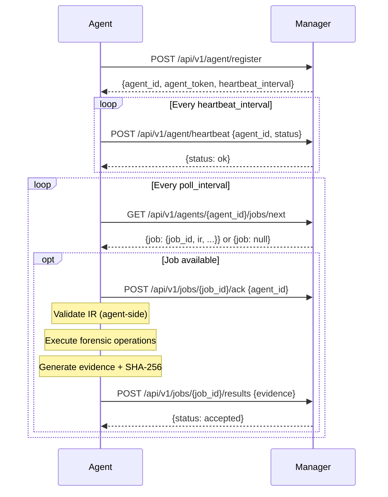

# Proteus Agent Architecture

## Overview

PROTEUS is a defensive digital-forensics framework. Forensic agents are distributed nodes that run on target systems, receive validated JOCKY IR jobs from the central manager, execute approved forensic operations, and upload structured evidence with cryptographic integrity.



## Agent Lifecycle



## Agent Package Structure

```
runtime/agent/
├── __init__.py         — package exports
├── contracts.py        — typed request/response models (Priority 6)
├── heartbeat_client.py — background heartbeat worker
├── ir_validator.py     — agent-side IR validation (Priority 8)
├── evidence.py         — EvidenceItem + SHA-256 integrity
├── job_executor.py     — orchestrates full job pipeline
├── config.py           — environment-based configuration
├── polling.py          — main polling loop
└── main.py             — entry point (python -m runtime.agent)
```

## Security Boundary

The agent **only** executes operations in the approved allowlist:

| Operation | Description |
|---|---|
| `system.info` | OS, hostname, uptime |
| `system.users` | Local user accounts |
| `processes.list` | Running processes |
| `processes.details` | Process detail by PID |
| `network.interfaces` | Network adapter info |
| `network.connections` | Active TCP/UDP connections |
| `network.routes` | Routing table |
| `network.dns` | DNS configuration |
| `filesystem.metadata` | File metadata |
| `filesystem.hash` | File SHA-256 hash |

The agent **never**:
- Executes arbitrary Python, shell, or PowerShell
- Uses `eval()`, `exec()`, `shell=True`
- Accepts raw source code as a job
- Modifies evidence after collection

## Running the Agent

```bash
# Set configuration
export PROTEUS_SERVER_URL=http://localhost:5000
export LOG_LEVEL=INFO

# Run agent
.venv/bin/python -m runtime.agent

# Or with all options
PROTEUS_SERVER_URL=http://localhost:5000 \
HEARTBEAT_INTERVAL=30 \
POLL_INTERVAL=15 \
JOB_TIMEOUT=300 \
.venv/bin/python -m runtime.agent
```
