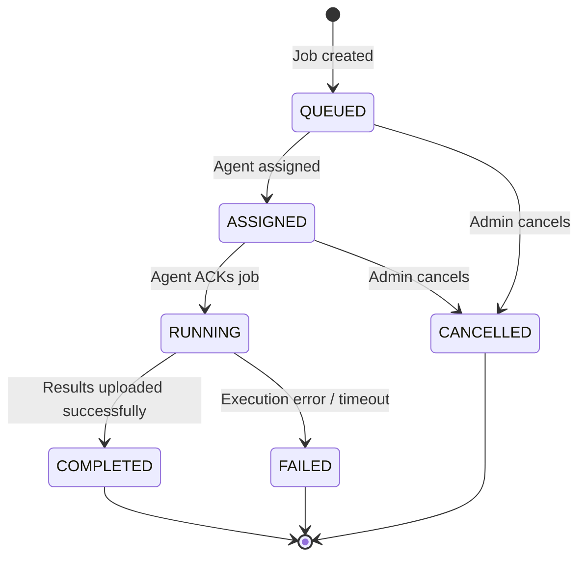

# Proteus Job Lifecycle

## Job States



## API Endpoints

| Method | Path | Description |
|--------|------|-------------|
| `POST` | `/api/v1/jobs` | Create a new job (validates IR) |
| `GET` | `/api/v1/jobs` | List jobs (filter by agent_id, status) |
| `GET` | `/api/v1/jobs/{job_id}` | Get job details + evidence |
| `GET` | `/api/v1/agents/{agent_id}/jobs/next` | Poll for next job (atomic claim) |
| `POST` | `/api/v1/jobs/{job_id}/ack` | Acknowledge job (ASSIGNED → RUNNING) |
| `POST` | `/api/v1/jobs/{job_id}/cancel` | Cancel job |
| `POST` | `/api/v1/jobs/{job_id}/results` | Upload results + evidence |

## Create Job

```json
POST /api/v1/jobs
{
  "agent_id": "agent-abc123",
  "investigation_id": "INV-001",
  "ir": {
    "version": "1.0",
    "ir_type": "jocky_forensic_ir",
    "investigation": "Network Investigation",
    "operations": [
      {"id": "op-001", "type": "system.info", "parameters": {}},
      {"id": "op-002", "type": "network.connections", "parameters": {}}
    ]
  }
}
```

Response `201`:
```json
{
  "job_id": "JOB-abc123",
  "agent_id": "agent-abc123",
  "investigation_id": "INV-001",
  "status": "ASSIGNED",
  "created_at": "2026-09-21T01:00:00+00:00"
}
```

## Atomic Job Claiming

The `GET /api/v1/agents/{agent_id}/jobs/next` endpoint is safe for concurrent access. An application-level lock ensures no two agents can claim the same job. Authentication via Bearer token enforces that agents can only poll their own jobs.

## Server-Side IR Validation

Before a job is created, the server validates the IR:
1. Version must be `"1.0"`
2. `investigation` must be non-empty
3. `operations` must be a non-empty list
4. Each operation must have a unique `id`
5. Each operation `type` must be in `APPROVED_OPERATIONS`
6. No forbidden fields (`code`, `shell`, `exec`, `eval`, `payload`, etc.)
